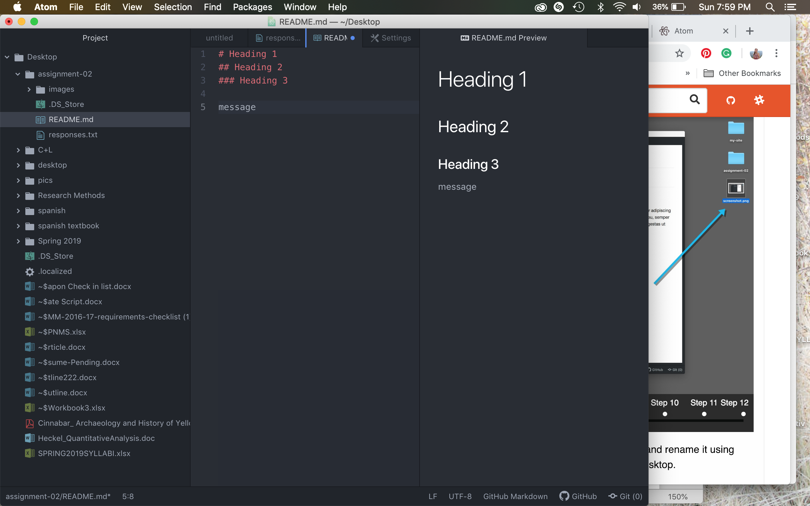

# Heading 1
## Maredith Heckel
### Heading 3

I'm taking this class to better my understanding of coding and website development. I think that it is an extremely useful skill to have. I'm excited to learn so much more!

I've learned that coding is not as intimidating as I previously thought, and that you need to pay attention to little details. I'm hoping to learn more about designing a website from scratch.

[Moodle Website](https://umonline.umt.edu/)

[My Responses](./responses.txt)

