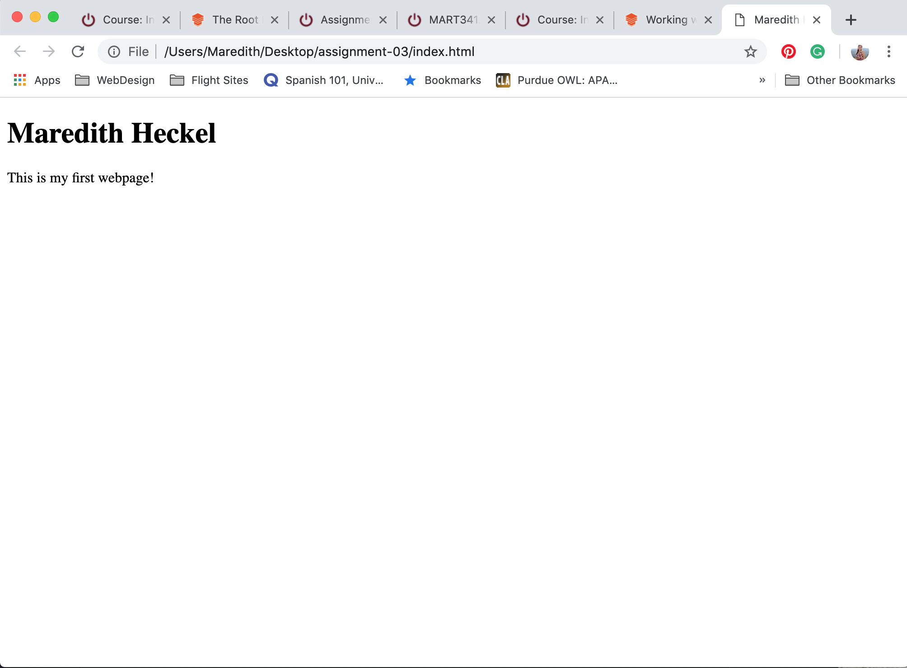

13. A browser is responsible for displaying the visuals of a webpage.It takes in CSS and HTML pages and visualizes it. I currently use google chrome to surf.

14. It is the type of language that one uses to create a webpage so that you can distinguish it from the content of the page. HTML is a common markup language because it is easy to learn.

