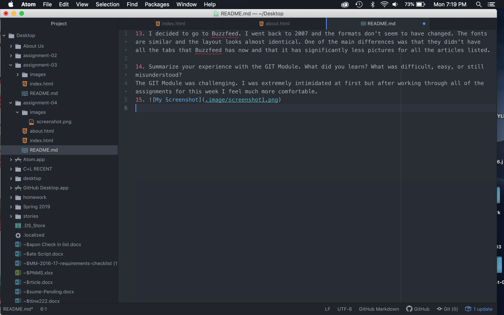

13. I decided to go to Buzzfeed. I went back to 2007 and the formats don't seem to have changed. The fonts are similar and the layout looks almost identical. One of the main differences was that they didn't have all the tabs that Buzzfeed has now and that it has significantly less pictures for all the articles listed.

14. Summarize your experience with the GIT Module. What did you learn? What was difficult, easy, or still misunderstood?
The GIT Module was challenging. I was extremely intimidated at first but after working through all of the assignments for this week I feel much more comfortable.

