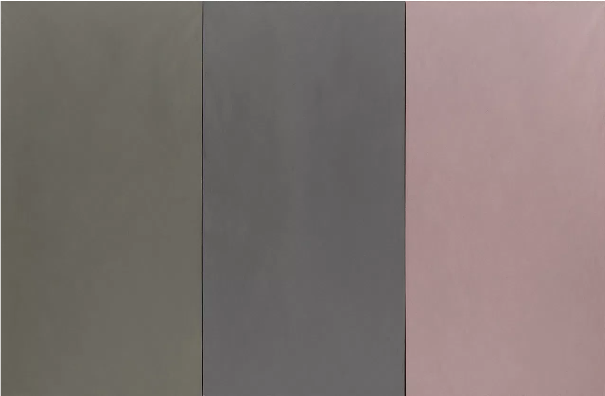

What is the difference between padding, margin, and borders?
Borders surround text/objects, margin is the space between a box/element and padding is the space between the content of the element and the element itself.

Embed the image of the artwork you used as inspiration. image icon

Free Response: Summarize your work cycle for this assignment.
It took me a while to find a piece of artwork that I enjoyed, but once I found it I was really happy! It is simple, which I like. This assignment was a struggle for me but I think I finally completed it after some trial and error.
